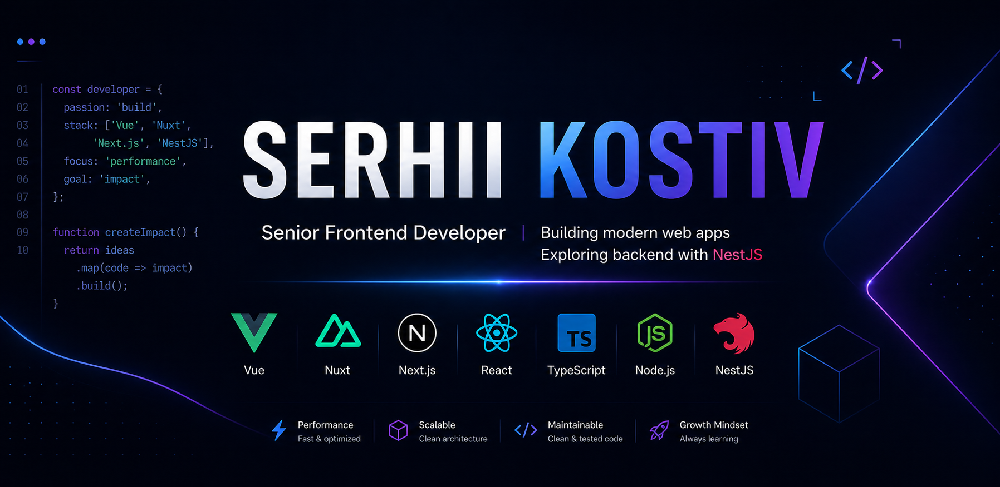

## I'm a Front-end Developer!

- 📍 Based in Ivano-Frankivsk, Ukraine;
- 🚀 Focused on building scalable architecture, clean code, and high-performance web applications;
- ⚡ Front-end Enthusiast & Continuous Learner.

### Connect with me:

[][portfolio]&nbsp;
[][linkedin]&nbsp;
[][email]

### Tech Stack:

<table>
  <tr>
    <td>
      
    </td>
    <td>
      
    </td>
    <td>
      
    </td>
    <td>
      
    </td>
  </tr>
  <tr>
    <td>
      
    </td>
    <td>
      
    </td>
    <td>
      
    </td>
    <td>
      
    </td>
  </tr>
  <tr>
    <td>
      
    </td>
     <td>
      
    </td>
    <td>
      
    </td>
    <td>
      
    </td>
  </tr>
  <tr>
    <td>
      
    </td>
    <td>
      
    </td>
    <td>
      
    </td>
    <td>
      
    </td>
  </tr>
  <tr>
    <td></td>
    <td>
      
    </td>
    <td>
      
    </td>
    <td></td>
  </tr>
</table>

_**Note:** hover over a skill to get detailed information about it.   The information will be displayed as a tooltip._

[linkedin]: https://www.linkedin.com/in/serhii-kostiv/
[email]: mailto:kostiv.serhii@gmail.com
[portfolio]: https://serhii-kostiv.github.io/
